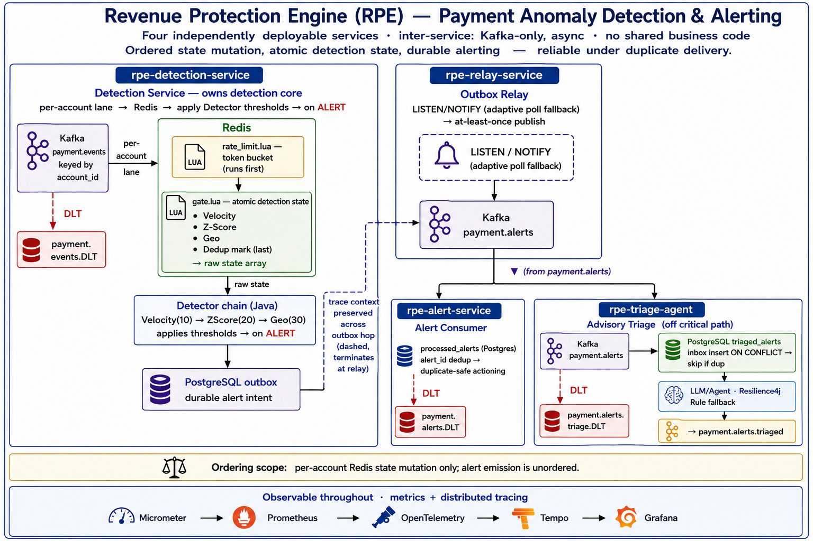
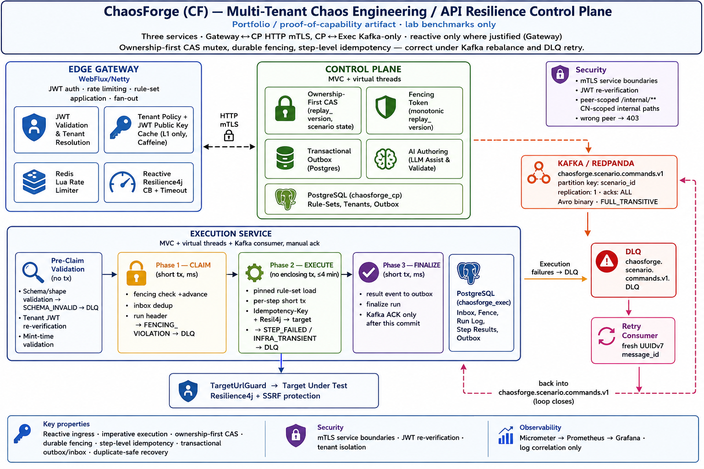
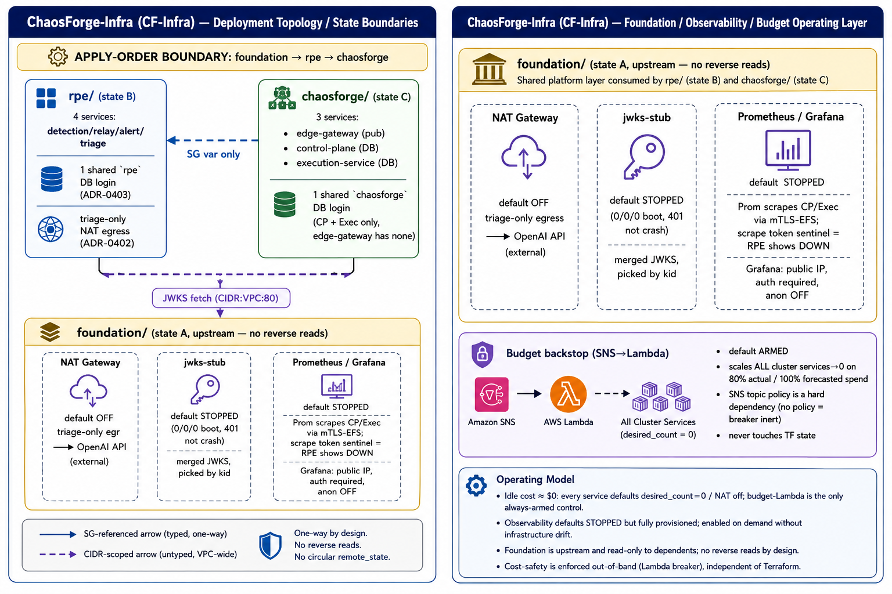

### Amit Vikram Satpathy
Backend & Distributed Systems Engineer | Java, Kafka, Spring Boot, AWS

9+ years across ERP, performance monitoring, enterprise benefits (Netflix OSS architecture), early-stage e-commerce, and a multi-vendor payment integration. Currently building two independent reference systems to validate distributed-correctness patterns under concurrency: **RPE** (fraud/anomaly detection) and **ChaosForge** (chaos engineering control plane) — backed by a lab AWS deployment architecture (**ChaosForge-Infra**).

**Execution Methodology:** Architecture, system design, and correctness verification owned end-to-end. Codebase implementations are validated against strict integration and failure-mode test gates.

---

**Focus areas**
- **Event-driven architecture** — Kafka transactional outbox/inbox, idempotent consumers, partition-keyed ordering (at-least-once + idempotent consumer, never trusting a transport's exactly-once claim)
- **Distributed correctness** — CAS ownership-fencing (chosen over Redlock — Kleppmann-based rationale: local lock-holding correctness ≠ system-wide safety under clock skew/GC pause)
- **Resilience engineering** — Resilience4j full-stack per boundary, fail-closed default with explicit, deliberate fail-open exceptions
- **Ephemeral IaC** — Independent multi-root state management, keyless deployment pipelines, and automated budget circuit breakers (scale-to-zero) to eliminate idle cloud costs.
- **AI integration** — Spring AI (Ollama/OpenAI) for advisory workflows; enforced determinism boundaries isolating LLM calls strictly off critical execution/replay paths.

**Engineering projects** *(Reference architectures / lab benchmarks)*
- 🛡️ **RPE** — event-driven fraud/velocity detection, 4-services, Redis Lua atomic gate, UUIDv5 deterministic replay-safe IDs.
    
  
    
  📄 **Architecture & Trade-offs →** [RPE ADR Index (29 Decisions)](https://github.com/amitvsatpathy90-source/revenue-protection-engine/edit/main/docs/adrs/README.md)
    
  
- 🌀 **ChaosForge** — multi-tenant chaos engineering control plane, 3-services, CAS fencing tokens, two-level cache with disclosed staleness bounds.
    
  
    
  📄 **Architecture & Trade-offs →** [ChaosForge ADR Index (43 Decisions)](https://github.com/amitvsatpathy90-source/chaosforge/blob/main/docs/adrs/README.md)
    
  
- ☁️ **ChaosForge-Infra** — 3-root Terraform deployment, AWS ECS Fargate/Lambda/FIS/IAM OIDC, deterministic apply ordering, live-verified health and Prometheus scrape endpoints.
    
  
    
  📄 **Architecture & Trade-offs →** [ChaosForge-Infra ADR Index (04 Decisions)](https://github.com/amitvsatpathy90-source/chaosforge-infra/blob/main/docs/adrs/README.md)
    

**Open to:** backend/distributed-systems IC roles — contract or full-time.
